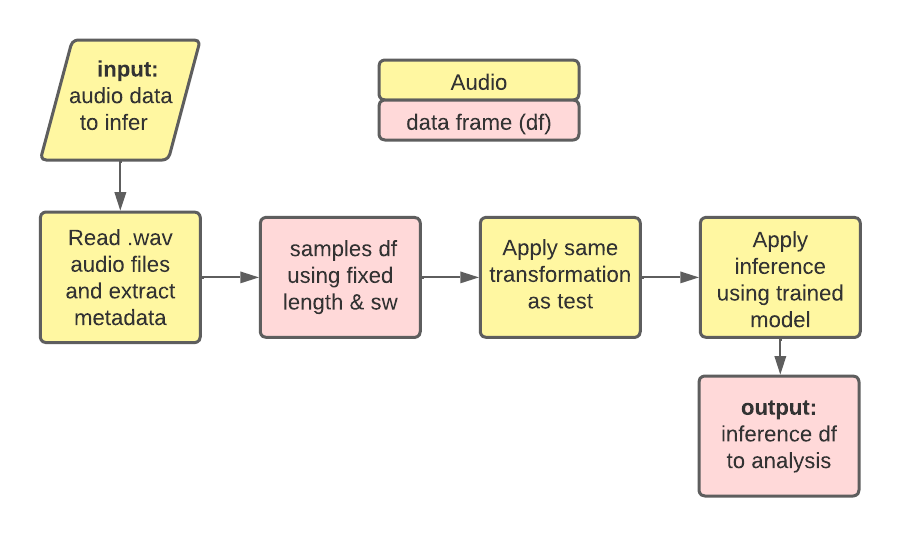

# Passive Acoustic Monitoring (PAM) Inferences

<div align="center">

</div>

Repository to solve the species identification problem over passive acoustic monitoring files using machine learning models.

# Inference pipeline

<div align="center">

</div>

# Usage Instructions
These usage instructions are composed of two levels of usability: users that want to interact directly with the raw sources of this library and users that just want to use the models to generate new inferences. 

## From raw sources:

1. Install [Conda](http://conda.io/)

2. Clone this repository

```bash
git clone https://github.com/soundclim/pam_inferences/
```

3. Create environment

```bash
cd pam_inferences
conda env create -f environment.yml
```
4. Upload your data in the `data/` folder. The structure of this data folder is agnostic to the project. In practice we will search for any .wav file, save its path, extract the metadata, and apply the machine learning model. One example of a data folder structure in a real-world project is the next one:

<div align="center">

</div>

5. Select the parameters as sliding window, window size, and the trained model using .yaml file. Save in `config/` folder Run the inferences 

```bash
python inferences.py --config configs/example.yaml
```

6. Visualize results in `resutls_analysis.ipynb` notebook

# From docker image to execute inferences

1. Install [Docker](https://docs.docker.com/engine/install/ubuntu/)

2. Pull docker image and create Chorus container

```bash
sudo docker run -d -it --name chorus jrudascas/chorus:1.0.6
```

3. Copy and modify [config.yaml](https://chorus.blob.core.windows.net/public/config.yaml) depending on your experimentation. Use the instruction inside the config.yml example file.

4. Move your config.yaml file to inside the chorus container

```bash
sudo docker cp config.yaml chorus:configs/config.yaml
```
5. Execute the inference using the follow command instruction:

```bash
sudo docker exec -it chorus python run.py --config configs/filename.yaml
```

6. Accessing the inference results

Access to the consolidated results of the inferences will be made through a public URL. The URL structure is described as:

```bash
https://chorus.blob.core.windows.net/public/inferences/NombreSitio_inferences_torch.parquet.gzip
```

Thus, for the INC20955 site, the inference URL will be:

```bash
https://chorus.blob.core.windows.net/public/inferences/INCT20955_inferences_torch.parquet.gzip
```

The download will be done through the browser and will be stored in the default downloads folder.

## License (TODO)

...


## Citing this work (TODO)

..-
